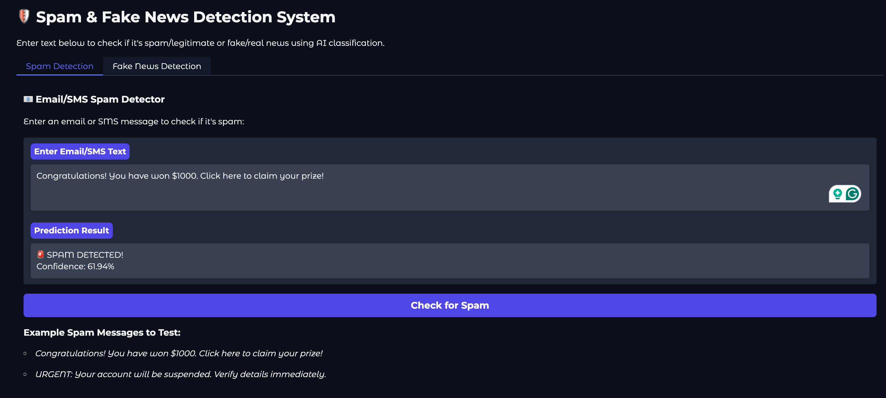

# Spam & Fake News Detection using NLP Classification

## Overview
A machine learning project to classify text as spam (emails/SMS) or fake news using NLP techniques.

## Features
- Detects spam messages and fake news articles
- Interactive Gradio interface for real-time testing
- Compares multiple ML algorithms
- Visualizes results and saves models

## Tech Stack
- **Python**
- **scikit-learn** (Naive Bayes, Random Forest, Logistic Regression)
- **pandas, numpy**
- **nltk**
- **matplotlib, seaborn**
- **Gradio**
- **joblib**

## What I've Done
- Preprocessed and vectorized text data
- Trained and evaluated ML models
- Built an interactive demo with Gradio
- Visualized and saved model results

---

## Gradio UI

You can interact with the model using the Gradio interface.  
**Screenshot:**  

---

## Notebooks

Explore the data analysis and model development in the Jupyter notebook:  
[Spam & Fake News Detection Notebook](https://colab.research.google.com/drive/1D7v9yIpfj4K691nCcNdPki7r14H33pZp?usp=sharing)

---

## Example

**Input:**  
> "Congratulations! You've won a free iPhone. Click here to claim."

**Output:**  
> **Label:** Spam

---

## Results

- Achieved high accuracy with Naive Bayes and Random Forest on both spam and fake news datasets.
- Visualizations include confusion matrices, ROC curves, and feature importance plots.

